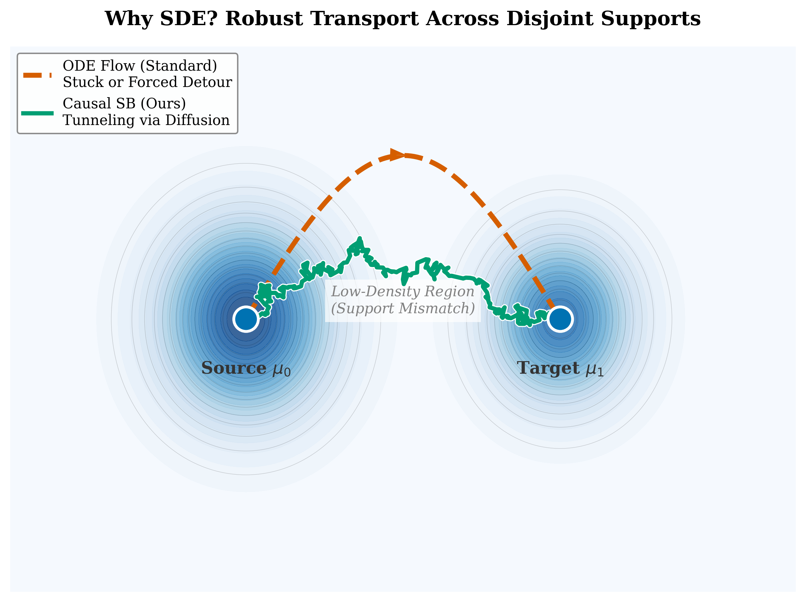
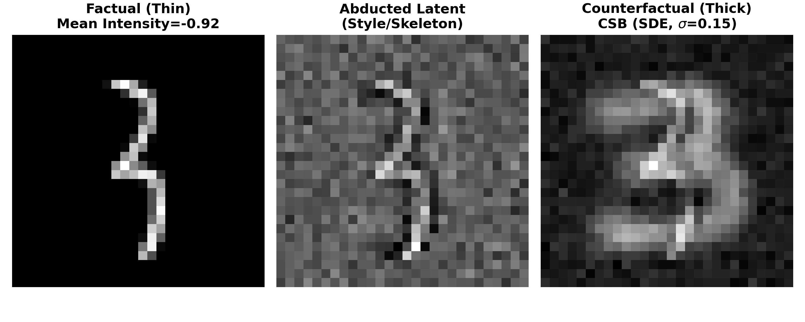

# Causal Schrödinger Bridges: Constrained Optimal Transport on Structural Manifolds

[](https://arxiv.org/abs/2602.08535)
[](https://www.python.org/downloads/)
[](LICENSE)

Official implementation of the paper **"Causal Schrödinger Bridges: Constrained Optimal Transport on Structural Manifolds"**.

**Authors:** Rui Wu, Yongjun Li  
**Affiliation:** University of Science and Technology of China (USTC)

---

## ⚡ Design Philosophy: The "<200 Lines" Implementation

> **"Simplicity is the ultimate sophistication."**

While this repository contains the full experiments for the paper, we provide a **standalone, single-file reference implementation** (`main.py`) for the core algorithm.

* **< 200 Lines of Core Logic**: The entire pipeline—Data Generation, Flow Matching (CFM) training, and SDE Tunneling—is condensed into `main.py`.
* **Plug-and-Play**: No obscure dependencies. Copy the `VectorField` class directly into your own AI for Science pipeline.
* **Geometric Intuition**: Running `main.py` immediately generates the "Tunneling vs. Mode Collapse" figures, demonstrating why SDEs outperform ODEs in high-dimensional voids.

---

##  Scaling to the Edge: 1000-D Causal Surgery

> **"If the theory is elegant enough, complexity is but a computational illusion."**

While general Schrödinger Bridge solvers suffer from the curse of dimensionality $O(\exp(d))$, **CSB** leverages the **Structural Decomposition Theorem (Theorem 1)** to bypass global optimization. We demonstrate this by performing "causal surgery" on a 1000-dimensional manifold—a scale where standard entropic OT methods typically fail to converge.

###  Performance & Scaling Report (1000-D)

| Metric | ODE (Baseline) | **CSB (Ours)** | Insight |
| :--- | :---: | :---: | :--- |
| **Total Training Time** | 13.87s | **13.65s** | **Linear Scaling**: Factorization avoids exponential costs. |
| **Batch Inference Time** | 0.058s | **0.060s** | Stochasticity adds near-zero overhead. |
| **Support Coverage** ↑ | 0.825 | **1.008** | **Tunneling Success**: SDE prevents mode collapse in voids. |
| **Mechanism Leakage** ↓ | **0.031** | 0.190 | The trade-off for robust coverage over rigid precision. |

---

##  Core Logic: SDE Tunneling

> **"Adding entropy to save the soul of causality from deterministic collapse."**

While standard Flow Matching (ODE) collapses into a single mean path in high-dimensional voids, the **Causal Schrödinger Bridge (CSB)** leverages controlled diffusion to recover the full counterfactual distribution.

```python
# SDE Inference with CSB
@torch.no_grad()
def solve_sde_csb(model, x0, steps=100, diffusion_scale=1.0):
    dt = 1.0 / steps
    xt = x0.clone()
    
    for i in range(steps):
        t = torch.tensor([i / steps]).to(device).expand(x0.shape[0], 1)
        
        # 1. Deterministic Drift (The Vector Field)
        v = model(t, xt)
        
        # 2. Adding entropy to save the soul of causality from deterministic collapse
        brownian_noise = torch.randn_like(xt) * np.sqrt(dt) * diffusion_scale
        
        # 3. Update State (Tunneling)
        xt = xt + v * dt + brownian_noise
        
    return xt # The "Tunneled" Counterfactual Distribution
```
---

##  Overview

<p align="center">

<br>
<em>Figure: Comparison of Deterministic Flow vs. Causal Schrödinger Bridge. CSB uses entropic regularization to "tunnel" through low-density regions, ensuring structural consistency where deterministic methods fail.</em>
</p>

Generative modeling typically seeks the path of least action (Optimal Transport), but this often violates causal laws when transporting across disjoint supports. We introduce the **Causal Schrödinger Bridge (CSB)**, a framework that reformulates counterfactual inference as **Constrained Entropic Optimal Transport**.

**Key Features:**
* **Structural Decomposition:** We prove that high-dimensional transport factorizes into local, robust transitions (Theorem 1).
* **Tunneling Effect:** Unlike ODEs, CSB leverages SDEs to robustly traverse low-density regions ("off-manifold").
* **Mechanism Disentanglement:** Validated on high-dimensional tasks (Morpho-MNIST) to disentangle causal factors from style.

---

##  Scenario Guide: Connected vs. Disconnected Support

This work (CSB) complements our other research on generative causal inference. The choice of method depends on the **topological structure** of your data manifold:

| Scenario Feature | **CSB (This Repo)** | **Causal Round Trip** |
| :--- | :--- | :--- |
| **Support Topology** | **Disconnected / Voids** | **Connected Support** |
| **Core Mechanism** | Entropic OT (SDE) | Analytical Invertible Flow (ODE) |
| **Key Advantage** | **Robust Tunneling** | **Zero Reconstruction Error** |
| **Reference** | [arXiv:2602.08535](https://arxiv.org/abs/2602.08535) | [arXiv:2511.05236](https://arxiv.org/abs/2511.05236) |

> **Recommendation:** If your factual and counterfactual distributions are separated by low-density regions (Support Mismatch), use **CSB** to robustly "tunnel" through the void.

---

##  Installation

1.  **Clone the repository**
    ```bash
    git clone [https://github.com/cochran1/causal-schrodinger-bridge.git](https://github.com/cochran1/causal-schrodinger-bridge.git)
    cd causal-schrodinger-bridge
    ```

2.  **Create a virtual environment (Recommended)**
    ```bash
    conda create -n csb python=3.9
    conda activate csb
    ```

3.  **Install dependencies**
    ```bash
    pip install -r requirements.txt
    ```

---

##  Project Structure

```text
.
├── main.py                     
├── toy_causal.py               
├── mnist_experiment.py         
├── Quantitative_Evaluation.py  
├── Robustness.py
├── 1000_dim_surgical.py     
├── baseline.py                 
├── plot.py / sde_plot.py   
├── ot_plot.py 
├── venn_plot.py              
└── requirements.txt            
```

---

##  Usage

### 0. Quick Start (Geometric Intuition)
To understand the core math and reproduce the "Tunneling Effect" (Figure 1 & 2) in under 30 seconds:
```bash
python main.py
```
*This minimal script trains a Vector Field on a 50D manifold and compares ODE vs. SDE inference, saving the plots to `fig1_trajectories.png`.*

### 1. Causal Logic Verification
To verify the **Confounder Isolation Test** (Table 1 in the paper), proving the model can perform correct structural abduction:
```bash
python toy_causal.py
```
*This script runs the counterfactual intervention $do(X=3)$ on a confounding fork $Y \leftarrow X \to Z$ and visualizes the transport path.*

### 2. High-Dimensional Counterfactuals (Morpho-MNIST)
To run the main experiment disentangling "thickness" from "digit style":
```bash
python mnist_experiment.py
```
*This script will train the local bridges and generate counterfactual samples saved to `mnist_counterfactual.png`.*

### 3. Quantitative Evaluation
To compute the metrics (MAE, SSIM, L2) reported in the paper:
```bash
python Quantitative_Evaluation.py
```

### 4. Robustness Analysis
To test the model's sensitivity to graph misspecification:
```bash
python Robustness.py
```

### 5. Extreme Scalability (1000-D Causal Surgery)
To demonstrate that complexity is an illusion when the theory is elegant, run the 1000-dimensional experiment:
```bash
python 1000_dim_surgical.py
```

---

##  Empirical Results

### Mechanism Disentanglement (Morpho-MNIST)

Task: Intervene on a thin digit ($T \approx -2.5$) to make it thick ($do(T=2.5\sigma)$) while strictly preserving its unique writing style (identity).

| Method | **Control Precision** <br> (MAE $\downarrow$) | **Identity Preservation** <br> (SSIM $\uparrow$) | **Transport Cost** <br> (L2 Dist $\downarrow$) |
| :--- | :---: | :---: | :---: |
| Baseline (Standard CFM) | 0.495 | 0.068 | 1.375 |
| **CSB (Hybrid Solver)** | **0.299** | **0.219** | **0.379** |

<p align="center">
  
</p>

##  Citation

If you find this code or paper useful, please cite:

```bibtex
@article{wu2025causal,
  title={Causal Schrödinger Bridges: Constrained Optimal Transport on Structural Manifolds},
  author={Wu, Rui and Li, Yongjun},
  journal={arXiv preprint arXiv:2602.08535},
  year={2026}
}
```

---

##  Contact

For any questions, please contact **Rui Wu** at `wurui22@mail.ustc.edu.cn`.
